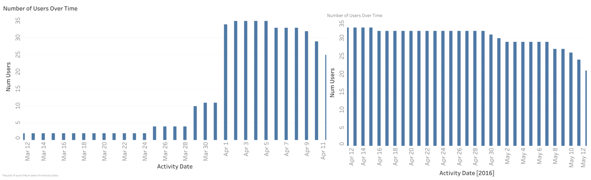
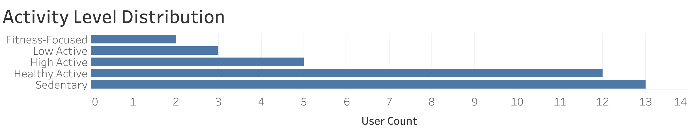
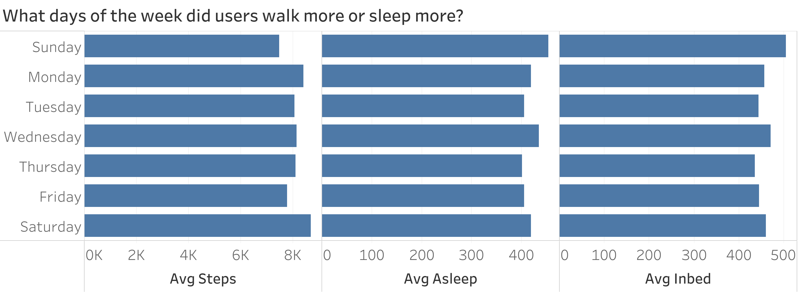
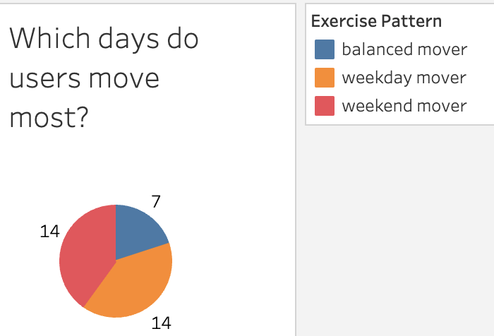
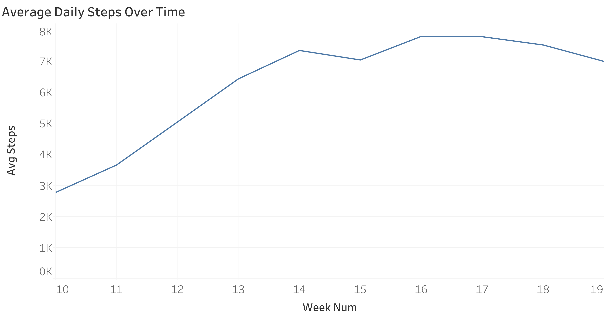
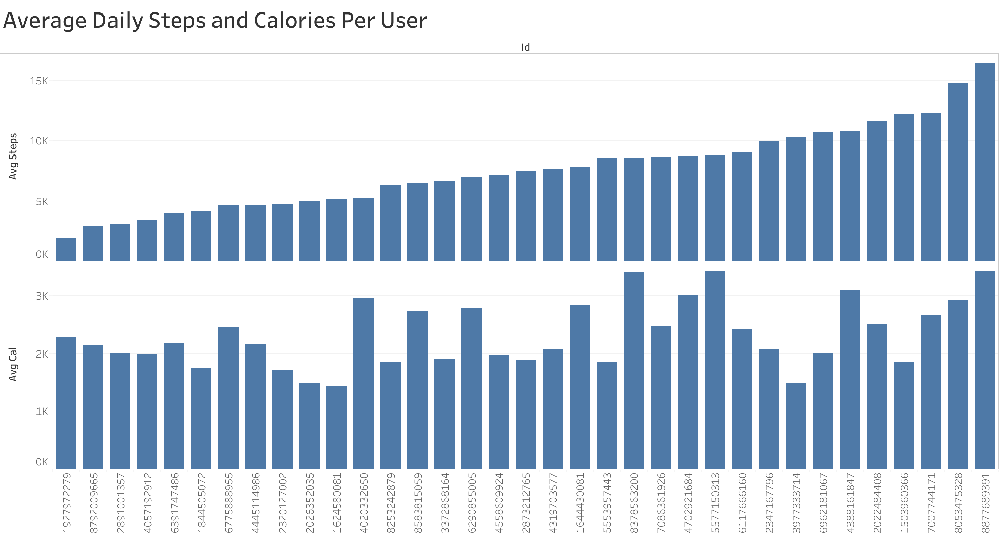
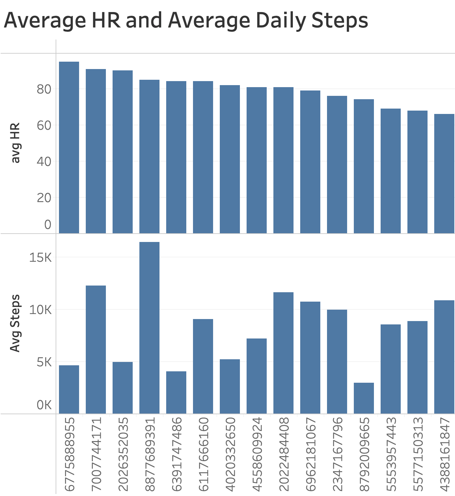

# Analyzing Fitbit Data to Recommend Bellabeat Marketing Strategies

## 1. Executive Summary
Bellabeat is a wellness technology company that creates health-focused smart products for women. This project analyzes publicly available Fitbit data to identify patterns in smart device usage and provide actionable marketing recommendations for one Bellabeat product.

**Key Takeaways:**
- 📉 **Over 54% of users walk fewer than 5,000 steps/day** — a large sedentary segment with potential for engagement.
- 📆 **Steps peak on Mondays and Saturdays**, suggesting ideal times for marketing campaigns.
- 🌙 **No strong correlation between sleep and activity** — sleep features should be marketed independently.
- 📊 **Users split evenly between weekday-focused and weekend-focused exercisers**, supporting segmented messaging.
- ⚠ **Data logging inconsistencies** highlight the importance of product onboarding and education.

---

## 2. Business Problem & Objective
**Business Problem:** Bellabeat wants to increase customer engagement by aligning its marketing campaigns with real-world usage patterns of wearable fitness devices.

**Objective:** Use Fitbit dataset insights to recommend marketing strategies for **one Bellabeat product** that fit consumer behavior trends.

---

## 3. Data Source & Preparation
**Source:** [Fitbit Fitness Tracker Data – Kaggle](https://www.kaggle.com/datasets/arashnic/fitbit)  
**Time Frame:** March 12, 2016 – May 12, 2016  
**Data Scope:** Activity, sleep, and heart rate logs for 30+ users over two non-continuous one-month periods.

**Data Preparation Steps:**
1. Uploaded CSV files into **Google BigQuery**.
2. Converted datetime formats to allow uploads.
3. Checked and removed duplicates:
   - 525 duplicate rows in March–April MinuteSleep data.
   - 543 duplicate rows in April–May MinuteSleep data.
   - 3 duplicates in SleepDay dataset.
4. Merged datasets from two periods after confirming overlapping users.

**Chart 1:** Daily participant count over time  

---

## 4. Key Analysis & Findings

### 4.1 User Activity Levels
Users were categorized based on **average daily steps**:
- Sedentary: <5,000 steps/day
- Low Active: 5,000–6,999
- Healthy Active: 7,000–9,999
- High Active: 10,000–12,499
- Fitness-Focused: ≥12,500

The **7,000-step threshold** for “Healthy Active” is supported by research showing significant health benefits starting at this level of daily walking ([Ding et al., *The Lancet Public Health*, 2025](https://doi.org/10.1016/S2468-2667%2825%2900046-3)).

**Finding:** 54% of users were sedentary. Only 12% were high active or fitness-focused.  
**Chart 2:** Distribution of users by activity level  

---

### 4.2 Day-of-Week Patterns
- Most steps: **Mondays** and **Saturdays**.
- Most sleep: **Sundays** and **Wednesdays**.
- Suggests opportunities for timing campaigns when activity is highest.

**Chart 3:** Average daily steps by day of week  

---

### 4.3 Weekday vs. Weekend Movers
Users were segmented based on proportion of steps taken on weekdays vs. weekends:
- **Weekday movers** (>73% of steps on weekdays)
- **Weekend movers** (<69% of steps on weekdays)
- **Balanced movers** (69–73%)

**Finding:** Even split between weekday and weekend movers, with a small balanced group.  
**Note on Thresholds:**
Since a week has 5 weekdays and 2 weekend days, a truly balanced mover would walk about 71.4% of their steps on weekdays. I set 69%–73% as the “balanced” range to allow for small fluctuations in daily activity.
Users above 73% were labeled weekday movers.
Users below 69% were labeled weekend movers.
These cutoffs are approximate and chosen for simplicity in segmentation rather than strict statistical precision, which is appropriate for the exploratory nature of this project.

**Chart 4:** Exercise pattern segmentation  

---

### 4.4 Sleep vs. Activity
Correlation between **steps** and **sleep duration**:
- Steps vs. minutes asleep: **r = -0.19** (no meaningful relationship).
- Steps vs. time in bed: **r = -0.17** (no meaningful relationship).

Refer to **Chart 3**

---

### 4.5 Time Trends
Average daily steps rose in the middle of the study and dropped during partial data weeks (Week 10 & 19).

**Chart 5:** Weekly average steps over time  

---
### 4.6 Activity vs. Other Metrics
To explore how physical activity related to other health measurements:

- **Steps vs. Calories Burned:**  
  Stacked bar chart shows that higher steps did not consistently correspond to higher calories burned.  
  Example: One user logged **8,911 steps but only 1,481 calories**, while another logged **0 steps but over 2,000 calories** — likely due to incomplete device syncing or manual logging errors.

- **Steps vs. Heart Rate:**  
  No clear pattern emerged between average daily steps and average heart rate.

- **Sleep vs. Steps:**  
  Consistent with the correlation analysis, stacked bars show little to no relationship between activity level and sleep duration.

**Chart 6:** Steps vs. Calories Burned  

**Chart 7:** Steps vs. Average Heart Rate  

---

## 5. Top 5 Business Insights & Recommendations

1. **Large Sedentary Segment**
   - **Finding:** 54% of users average <5,000 steps/day.
   - **Why It Matters:** These users have the most to gain from small behavior changes.
   - **Recommendation:** Market **Bellabeat’s smart jewelry** or app reminders to help women break sedentary habits through motivational nudges.

2. **Activity Peaks on Mondays & Saturdays**
   - **Finding:** Steps are highest on Mondays (+8% above average) and Saturdays (+6%).
   - **Why It Matters:** Timing promotions during peak activity can increase engagement.
   - **Recommendation:** Launch challenge-based campaigns like “Move-It Mondays” or “Step-Up Saturdays”.

3. **Sleep & Activity Are Separate Behaviors**
   - **Finding:** No meaningful correlation between steps and sleep.
   - **Why It Matters:** Marketing should address these features independently.
   - **Recommendation:** Position Bellabeat’s sleep tracking for users seeking rest quality, not just workout optimization.

4. **Two Distinct Movement Patterns**
   - **Finding:** Users split evenly between weekday-focused and weekend-focused exercisers.
   - **Why It Matters:** Messaging should fit both lifestyles.
   - **Recommendation:** Offer personalized reminders and content based on activity patterns.

5. **Device Logging Inconsistencies**
   - **Finding:** Calories and HR logs sometimes misaligned with activity levels.
   - **Why It Matters:** Inaccurate data can reduce product trust.
   - **Recommendation:** Strengthen onboarding education to ensure users sync devices correctly.

---

## 6. Limitations & Assumptions
- Dataset represents Fitbit users from 2016, not Bellabeat’s current customers.
- Assumes behavioral patterns from Fitbit users are applicable to Bellabeat’s target demographic.
- Data logging inconsistencies may impact precision of certain metrics.

---

## 7. Next Steps
- Gather Bellabeat-specific user data for comparison.
- Test targeted campaigns on distinct activity segments.
- Explore deeper time-of-day activity trends to optimize notification timing.

---

## 8. Files in This Repository
- `README.md` – This case study.
- `bellabeat_analysis.sql` – Full SQL code used in analysis.
- `/charts` – Visualization images.
